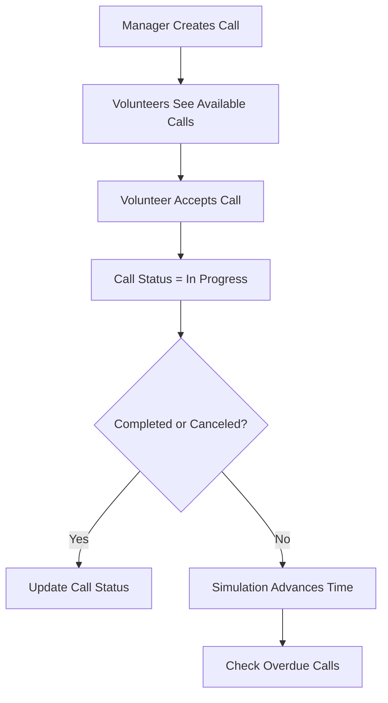

# MDA Volunteer Management System

A Windows-based system built as part of the *Windows Systems Mini Project* course. The system helps manage Magen David Adom (MDA) volunteers and emergency calls in a simple and efficient way.

Developed with C#, .NET, and WPF, the project follows clean architecture principles, MVVM, and modern C# practices.

---

## 📑 Table of Contents

* [About the Project](#about-the-project)
* [Technologies Used](#technologies-used)
* [System Overview](#system-overview)
* [Main Features](#main-features)
* [How It Works](#how-it-works)
* [Extra Features](#extra-features)
* [Setup & Usage](#setup--usage)
* [Screenshots](#screenshots)
* [Credits](#credits)

---

## 📝 About the Project

This project simulates how a volunteer organization (MDA) manages emergency calls and volunteer assignments.

* **Managers** manage calls, volunteers, and system settings.
* **Volunteers** accept calls, mark completion, and track their history.
* A **simulator** advances time, showing overdue calls and risk alerts.

---

## 🛠 Technologies Used

| Category             | Tools & Concepts          |
| -------------------- | ------------------------- |
| Language & Framework | C#, .NET 8.0, WPF         |
| Architecture         | Multi-Layer (DAL, BL, UI) |
| Design Patterns      | MVVM, Singleton, Factory  |
| Data Handling        | LINQ, XML Storage         |
| Async & Simulation   | Threads, Timers           |
| Version Control      | Git, GitHub               |

---

## 🏗 System Overview

The system consists of three main layers:

```
[ User Interface (WPF) ] <--> [ Business Logic (BL) ] <--> [ Data Layer (DAL + XML) ]
```

* **DAL:** Raw data handling (CRUD, XML)
* **BL:** Business logic, rules, validation
* **UI:** WPF-based interface using MVVM & Data Binding

---

## 🌟 Main Features

**Manager:**

* Manage volunteers & calls (Add/Edit/Delete)
* View statistics and call history
* Configure system settings & risk alerts
* Run the simulation

**Volunteer:**

* Accept calls within a chosen distance
* Complete or cancel calls
* Track call history

**Simulation:**

* Asynchronously advances time
* Detects overdue calls automatically

---

## 🔄 How It Works



---

## 🎯 Extra Features

* Password encryption & strength checking
* Double filtering & sorting in data grids
* Show/hide password toggle in login screen
* Custom icons & hover effects for buttons
* Configurable risk thresholds for overdue alerts

---

## ⚙️ Setup & Usage

1. Clone the repository:

   ```bash
   git clone https://github.com/your-username/MDA-Volunteer-System.git
   ```
2. Open with **Visual Studio 2022**
3. Build & Run
4. Default Users:

   * **Manager:** `shimon78900`
   * **Volunteer:** `grinfeld770`

---

## 🖼 Screenshots

| Screen               | Description           |
| -------------------- | --------------------- |
| Login Screen         | *Add screenshot here* |
| Volunteer Management | *Add screenshot here* |
| Call Management      | *Add screenshot here* |
| Simulation Panel     | *Add screenshot here* |

---

## 👏 Credits

* **Course:** Windows Systems Mini Project, 2025
* **Developers:** Shimon Khakshour & Partner
* **Instructor:** Yair Goldstein
