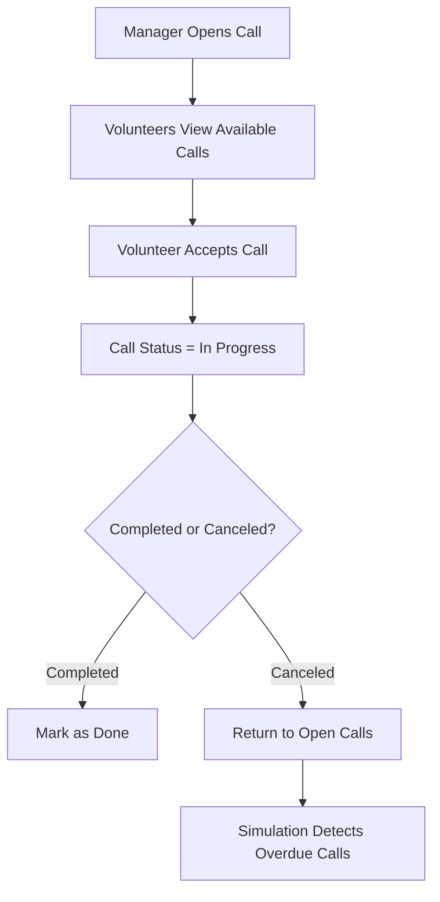

# 🚑 MDA Volunteer Management System

**A modern Windows application for managing Magen David Adom (MDA) volunteers and emergency calls.**
Built in **C# with WPF** as part of the *Windows Systems Mini Project* course, this project combines clean architecture, real-time simulation, and a rich graphical interface to deliver a full-featured management system.

---

## 🎯 Motivation

Volunteer organizations like MDA require quick, reliable, and easy-to-use systems to manage both volunteers and emergency calls.
We wanted to explore:

* 🏗 Multi-layer architecture with clear separation of concerns
* 🎨 Modern WPF UI using MVVM and data binding
* ⏱ Asynchronous simulation for real-world scenarios
* 🧩 Clean, modular code design suitable for extensions

---

## ✨ Features

| Category           | Highlights                                                            |
| ------------------ | --------------------------------------------------------------------- |
| **Volunteer Mgmt** | Add, edit, delete volunteers, set distance limits, view call history  |
| **Call Handling**  | Open calls, assign volunteers, auto-detect overdue calls              |
| **Simulation**     | System clock control, async time progression, risk alerts             |
| **UI/UX**          | Modern WPF interface, filtering & sorting, password security features |
| **Data Layer**     | In-memory & XML storage, LINQ-based queries, modular DAL & BL layers  |

---

## 🏗 Architecture Overview

```
MDA Volunteer System
├── DAL        # Data Access Layer: CRUD, XML Storage
├── BL         # Business Logic Layer: Rules, Validation, Services
├── UI (WPF)   # Presentation Layer: MVVM, Data Binding, Views
└── Simulation # Async system clock, overdue detection
```

**Design Patterns:** MVVM, Singleton, Factory Method
**Technologies:** C#, .NET 8.0, LINQ, XML, WPF

---

## 🖥 System Flow



---

## 🧩 Extra Features (Bonuses)

* 🔐 **Password Security** – Strong password validation & encryption
* 🗂 **Advanced Filtering** – Multi-criteria filtering for volunteers & calls
* 👁 **Show/Hide Password** toggle in login screen
* 🎨 **UI Styling** – Icons, hover effects, clean layout
* ⚡ **Performance** – Async simulation & LINQ optimization

---

## 🛠 How to Run

```bash
# Clone the repository
git clone https://github.com/YOUR_USERNAME/MDA-Volunteer-System.git
cd MDA-Volunteer-System

# Open with Visual Studio 2022
# Build & Run
```

Default Users:

* **Manager:** shimon78900
* **Volunteer:** grinfeld770

---

## 🖼 Demo Screenshots

| Screen               | Description                             |
| -------------------- | --------------------------------------- |
| Login Screen         | Secure login for managers & volunteers  |
| Volunteer Management | Add, edit, view volunteer details       |
| Call Management      | Manage calls & assignments              |
| Simulation Panel     | Real-time system clock & overdue alerts |

---

## 👨‍💻 Authors

- [Shimon Khakshour](https://github.com/shimon2005)
- [Levi Grinfeld](https://github.com/grindeld77)

Course: Windows Systems Mini Project, 2025
Instructor: -[Yair Goldstein] (https://github.com/yair-go)
